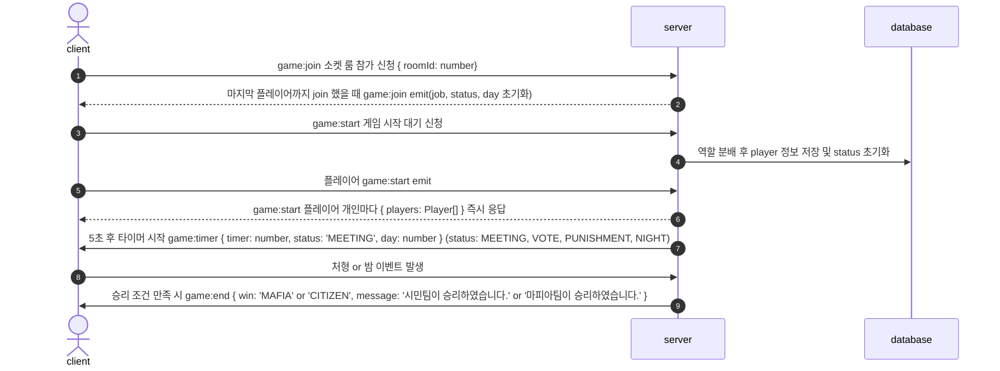
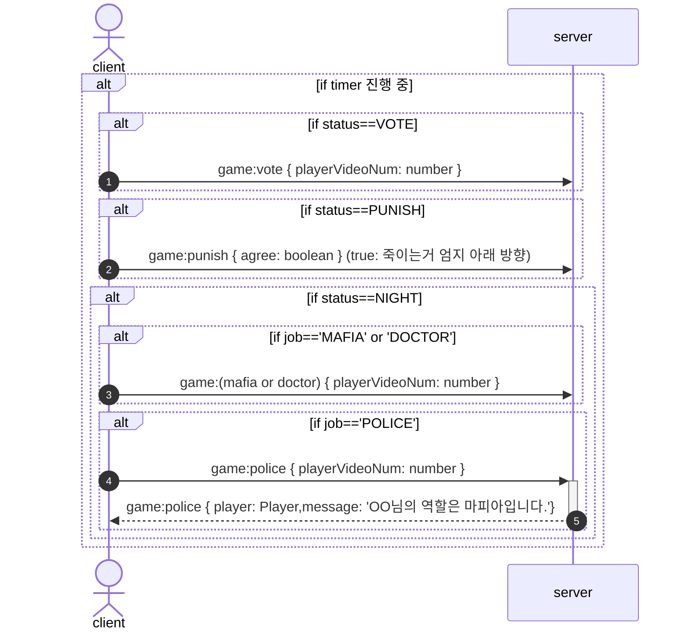
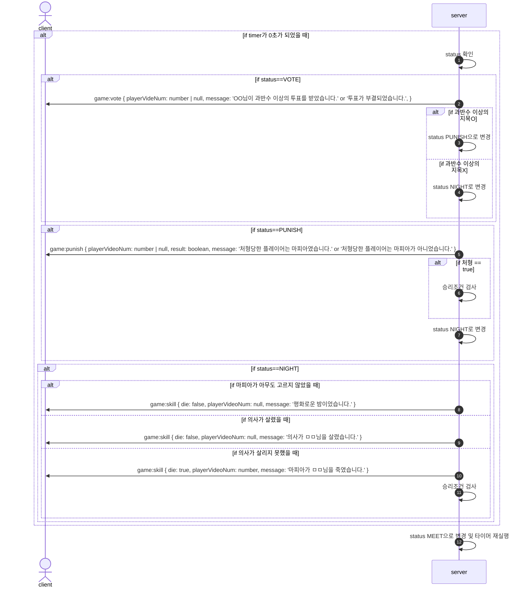

## 프로젝트: Fafia(Face + Mafia)
- 웹에서 서로의 얼굴을 보면서 플레이하는 마피아 게임입니다.
- 서비스에서 사회자 역할을 대신하여 게임을 진행합니다.
- 게임 진행 중 플레이어 지목할 때 생동감을 살리기 위해 카메라 인식을 도입하여 직접 손을 움직여 플레이합니다.
- 상대방의 직업을 메모할 수 있는 기능을 이용하면 다른 플레이어의 의심되는 직업 필터를 설정할 수 있습니다.
- 오프라인에서는 밤(게임 턴)에 다른 사람의 소리가 들리는 불편한 점을 해소했습니다.

Frontend Repository<br/>
- https://github.com/Mirai1412/Capstone-Front

Backend Repository<br/>
- https://github.com/MJoon-Jung/Mafia.git

### 사용 기술
```
TypeScript, JavaScript
nuxt.js, nest.js, socket.io
mediapipe, tensorflow.js
MySQL, redis
AWS, Docker, Github, Github Actions
```
<br/>

1. 프로젝트 준비 <br/> 

mysql, redis, env 셋팅
```
git clone https://github.com/MJoon-Jung/Mafia.git
cd ./Mafia
cp .env.example .env.development
```

2. 설치
```
npm install
```

3. 데이터베이스 초기 데이터 셋팅
```
npm run seed:run
```

4. 서버 시작
```
npm run start
```

### 인프라 구조/배포 자동화


### 게임 시퀀스 다이어그램






